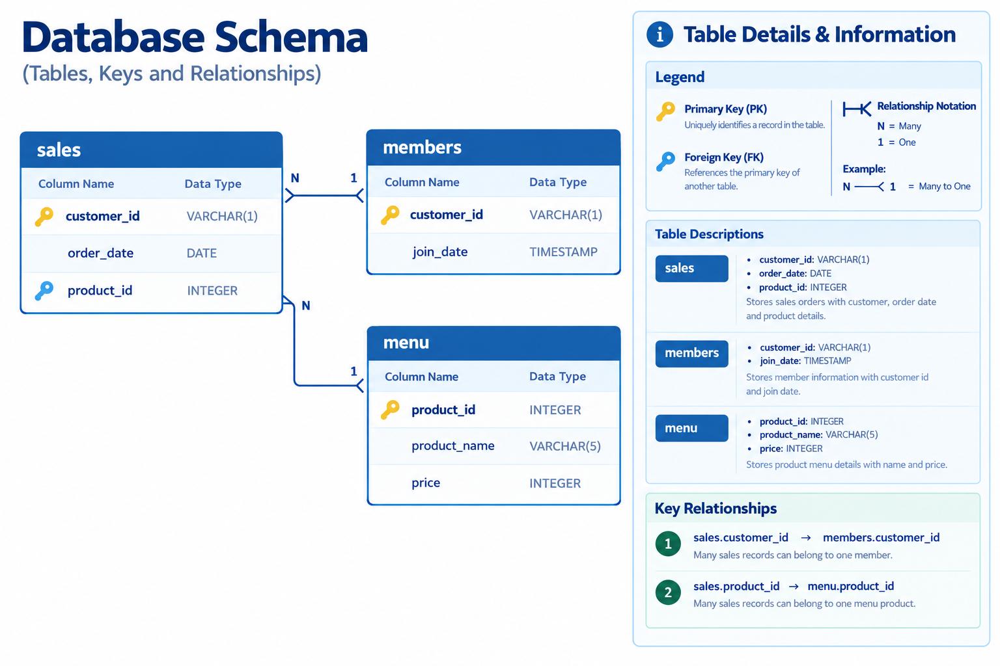

# Case Study #1: Danny's Diner

**Tool:** MySQL 8 (MySQL Workbench) | **Skills:** joins, aggregation, CTEs, window functions, CASE logic

Challenge by Danny Ma: https://8weeksqlchallenge.com/case-study-1/

Blog post (full walkthrough): [Case Study #1: Danny's Diner](https://sushant-jha.super.site/my-blogs/case-study-1-dannys-diner)

[Back to all case studies](../README.md)

## The question

Danny opened a small Japanese restaurant (sushi, curry, ramen) in early 2021 and collected basic data on sales, the menu and loyalty-program members. He wants to understand visit patterns, spending habits and favourite dishes, and decide whether to expand the loyalty program.

## The data

Three tables: `sales` (15 orders), `menu` (3 items), `members` (2 join dates). See [`data/`](data/).

## Approach

- Joined `sales` to `menu` for anything involving price or product name.
- Used `COUNT(DISTINCT order_date)` for visits so multiple orders on one day count as one visit.
- Used `DENSE_RANK()` rather than `ROW_NUMBER()` for "first/last/most popular", so ties are kept instead of picked arbitrarily.
- Treated the join date as a member day (`>=`) everywhere: member flag, first purchase as a member, and the first-week 2x bonus.
- For the January points question, counted all January orders, not just post-join ones, and kept the sushi 2x rule alongside the first-week bonus.
- Built a reusable "member + ranking" table in the bonus questions so the team doesn't need to re-join raw tables.

Full queries: [`analysis/solutions.sql`](analysis/solutions.sql). Results: [`output/results.md`](output/results.md).

## What I found

- **A is the highest spender ($76), B is the most frequent visitor.** B spent almost as much ($74) over 6 visit days versus A's 4. Spend shows value; visit frequency hints at loyalty. Neither tells the whole story alone.
- **Ramen is the most popular item** (8 of 15 orders). A and C lean heavily on ramen, while B splits evenly across all three dishes.
- **A and B both spent meaningfully before joining** ($25 and $40), so Danny could have invited them to the program earlier.
- **Points: A 860, B 940, C 360.** B edges ahead of A because of two sushi orders, which earn double.
- **With the first-week 2x bonus, A reaches 1,370 points and B 820 by end of January.**
- **Three profiles:** A high-value, B high-frequency, C low-frequency with a clear preference for ramen.

## Takeaway

SQL gives the answer, but asking the right business question is the real skill. The bonus questions were my first taste of building a reusable dataset instead of one-off queries.

## Limitations

15 orders over about a month is too small to draw firm conclusions. Treat the findings as illustrations of the method.

---
Dataset and problem statement © Danny Ma, 8 Week SQL Challenge. Solutions are my own.

---
*If you find any errors, feel free to email me at [sushant.kr.jha02@gmail.com](mailto:sushant.kr.jha02@gmail.com).*
