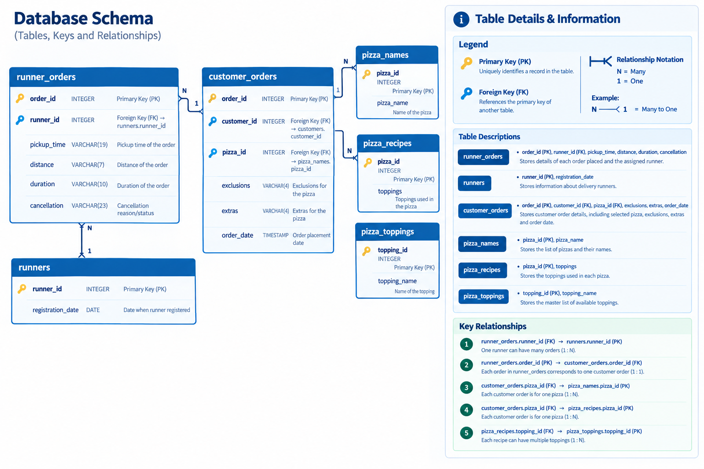

# Case Study #2: Pizza Runner

**Tool:** DuckDB | **Skills:** data cleaning, string parsing, regex, CTEs, window functions, ROLLUP, schema design

Challenge by Danny Ma: https://8weeksqlchallenge.com/case-study-2/

Blog post (full walkthrough): [Case Study #2: Pizza Runner](https://sushant-jha.super.site/my-blogs/case-study-2-pizza-runner)

[Back to all case studies](../README.md)

## The question

Danny launched "Uber for pizza": he recruited runners and built an app to take orders. Now he needs to understand how delivery operations are performing: order patterns, runner efficiency, and how customised pizzas are made and delivered. The raw data needs cleaning before it is usable.

## The data

Six tables: `runners`, `customer_orders`, `runner_orders`, `pizza_names`, `pizza_recipes`, `pizza_toppings`. See [`data/`](data/).

## Approach

- **Cleaning inline.** Missing values show up as `NULL`, `'null'` and `''`, so every filter checks all three. `WHERE cancellation IS NULL` alone silently misses cancelled-order rows.
- **Units stripped with regex.** `regexp_extract(distance, '[0-9.]+')` turns `'23.4 km'` and `'20km'` into numbers; `'[0-9]+'` does the same for durations.
- **Grain first.** One row in `customer_orders` is one pizza, not one order. Pickup time and distance belong to the order, so I collapse to order level before averaging or summing. Otherwise a 3-pizza order counts three times.
- **Exclusions and extras.** Comma-separated IDs are split with `string_split` + `unnest` and joined to `pizza_toppings`.
- **Identical pizzas in one order.** For the order-item and ingredient-list questions I give each pizza row a `line_id`, because order 4 has two identical pizzas and order 10 has two Meatlovers with different changes.
- **Revenue vs delivery cost.** Revenue is pizza-level and runner pay is order-level, so they are calculated separately and then combined.

Full queries: [`analysis/solutions.sql`](analysis/solutions.sql). Results: [`output/results.md`](output/results.md).

## What I found

- **14 pizzas across 10 orders; 12 pizzas were delivered** (9 Meatlovers, 3 Vegetarian).
- **Delivery success varies by runner:** Runner 1 delivered 100% of orders, Runner 2 75%, Runner 3 50%. With 1 to 4 orders each, that is a small sample.
- **Pickup takes longest with Runner 2** (about 20 minutes on average, versus 14 for Runner 1 and 10 for Runner 3).
- **Bigger orders take longer to prepare:** about 12 minutes for 1 pizza, 18 for 2 and 29 for 3. One single-pizza order (order 8) took 21 minutes, which shows the pattern isn't perfectly clean.
- **Delivery speeds look suspicious:** Runner 2's order 8 works out to 93.6 km/h, which is not plausible on a bike or scooter. It points to a data-entry problem in distance or duration. Speeds for Runners 1 and 2 also rise over time.
- **Bacon is the most added extra (4) and cheese the most excluded (4).** Bacon (12), mushrooms (11) and cheese (10) are the most used ingredients in delivered pizzas.
- **Money:** $138 from delivered pizzas, $142 if extras cost $1 each. After paying runners $0.30/km (145.2 km, $43.56), **$94.44** is left from the $138.
- **Adding a Supreme pizza needs no schema change**, only rows in `pizza_names` and `pizza_recipes`.

## Design note

Storing toppings as a comma-separated string works for this exercise but forces string parsing in every query. In a real system I would use a junction table between pizzas and toppings, and another for order exclusions and extras.

## Takeaway

The SQL was never the hard part. Understanding what one row represents, before writing a query, is what made everything else click: business question, data grain, joins, filters, aggregation, insight, in that order.

## Limitations

Ten orders is too small for firm conclusions. The ratings table in D3 uses sample data I made up to demonstrate the schema, so it says nothing about real runner performance.

---
Dataset and problem statement © Danny Ma, 8 Week SQL Challenge. Solutions are my own.

---
*If you find any errors, feel free to email me at [sushant.kr.jha02@gmail.com](mailto:sushant.kr.jha02@gmail.com).*
