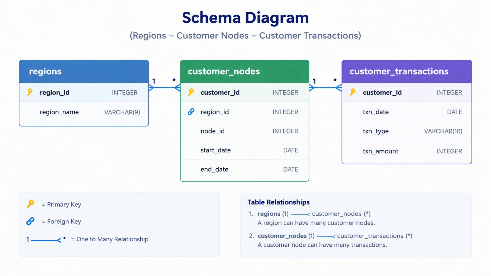

# Case Study #4: Data Bank

**Tool:** DuckDB | **Skills:** grain and denominators, window functions, percentiles, cumulative balances, calendar tables, capacity modelling

Challenge by Danny Ma: https://8weeksqlchallenge.com/case-study-4/

Blog post (full walkthrough): [Case Study #4: Data Bank](https://sushant-jha.super.site/my-blogs/case-study-4-data-bank)

[Back to all case studies](../README.md)

## The question

Data Bank is a digital-only bank that also stores customers' data, with storage tied to how much money they hold. The team wants to grow the customer base but has not worked out what that costs in storage. The job is to explore how customers are spread across nodes and regions, understand transaction behaviour, and model three ways of allocating storage so management can pick one with numbers.

## The data

Three tables: `regions`, `customer_nodes`, `customer_transactions`. See [`data/`](data/).

## Approach

- **Grain first.** `customer_nodes` is an allocation history, so customers are counted with `COUNT(DISTINCT customer_id)`. Open allocations (`end_date = '9999-12-31'`) are excluded from duration metrics.
- **Balances from signed amounts.** Deposits are positive, purchases and withdrawals negative, and a cumulative sum gives the running balance.
- **Reallocation days is more than one question.** Duration per stay, per customer-node pair and per customer all give different answers. A4 uses customer-node pairs and A5 uses individual stays.
- **Denominators are part of the metric.** The average deposit question uses every customer, so customers with no deposits would count as zero rather than disappear.
- **A continuous calendar for allocation.** Customers do not transact every day or month, so the allocation queries build one row per customer per day and carry the balance forward. Without this, quiet customers drop out of the monthly totals.
- **Three options modelled differently.** Option 1 uses the previous month-end balance, Option 2 the average balance over the previous 30 days, and Option 3 the peak balance in the month. Negative balances are floored at 0.
- **Interest accrues every day.** The 6% simple-interest query runs on the daily calendar, so days without transactions still earn interest.

Full queries: [`analysis/solutions.sql`](analysis/solutions.sql). Results: [`output/results.md`](output/results.md).

## What I found

- **500 customers across 5 regions, with 5 nodes in every region.** Australia has the most customers (110) and Europe the fewest (88).
- **Deposits total $1,359,168, but purchases ($806,537) and withdrawals ($793,003) together exceed them.** Across all customers, outflows are larger than deposits, which is why negative balances have to be handled explicitly.
- **Every customer has made at least one deposit,** averaging about 5 deposits and $2,718 each.
- **Active customers are plentiful but the data is short.** Between 70 and 192 customers a month had more than one deposit plus a purchase or withdrawal, and April is a partial month.
- **The three allocation options sit on a cost and responsiveness spectrum.** A monthly snapshot is cheap but ignores mid-month changes, a 30-day average smooths the balance, and real time is the most accurate and the most demanding on infrastructure.

## Design note

The transaction table has no balance column and no daily snapshot, so every balance query rebuilds history from signed amounts. A real system would store a daily balance table (or have the ledger maintain it) so allocation does not depend on replaying every transaction.

## Takeaway

A query can run perfectly and still answer the wrong question. Knowing what one row means, who is in the denominator, and which period an allocation applies to mattered more than the SQL itself.

## Limitations

- Several questions are interpretation calls (what "reallocated" means, what "increase by more than 5%" compares, what "real time" provisions). Those choices are stated in the query comments.
- B4 and B5 only see months in which a customer transacted, so a "previous month" can be several months earlier. Section C uses the gap-free calendar instead.
- Data covers January to April 2020, and April is partial, so Option 1 and 2 totals only exist for February onward and April is indicative.
- Simple interest is calculated; the compounding version is not built.
- The marketing slides in the extension request were made outside SQL and are not included here.

---
Dataset and problem statement © Danny Ma, 8 Week SQL Challenge. Solutions are my own.

---
*If you find any errors, feel free to email me at [sushant.kr.jha02@gmail.com](mailto:sushant.kr.jha02@gmail.com).*
