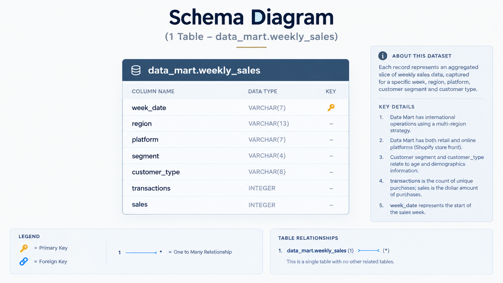

# Case Study #5: Data Mart

**Tool:** DuckDB | **Skills:** data cleaning, text-to-date conversion, grain and averages of averages, before/after analysis, seasonality baselines, unpivoting dimensions

Challenge by Danny Ma: https://8weeksqlchallenge.com/case-study-5/

Blog post (full walkthrough): [Case Study #5: Data Mart](ADD-BLOG-LINK)

[Back to all case studies](../README.md)

## The question

Data Mart is an online supermarket for fresh produce, with retail stores and a Shopify storefront across several regions. In June 2020 it switched every product and every step from farm to customer to sustainable packaging. Nobody could say what that did to sales.

The job is to clean one table, explore it, and then measure the impact: total sales for the 4 and 12 weeks either side of `2020-06-15`, compared against the same windows in 2018 and 2019, and broken down by region, platform, age band, demographic and customer type.

## The data

One table, `data_mart.weekly_sales`, no joins. See [`data/`](data/).

| Column | Type | What it is |
|---|---|---|
| `week_date` | text | Start of the sales week as day/month/year, e.g. `9/9/20` |
| `region` | text | Where the sale happened |
| `platform` | text | `Retail` or `Shopify` |
| `segment` | text | Age and demographic code, e.g. `C3`, `F1`. Missing values are the text `null` |
| `customer_type` | text | `New`, `Existing` or `Guest` |
| `transactions` | integer | Count of unique purchases |
| `sales` | numeric | Dollar amount of purchases |

## Approach

- **Grain first.** One row is a weekly slice already rolled up by week, region, platform, segment and customer type. It is not a customer or an order, so any average of a column is an average of averages.
- **`'null'` is a string, not a NULL.** Missing segments are the literal text `null`, so `IS NULL` skips them. The cleaning step checks for the string and maps it to `unknown`.
- **Dates are text.** `week_date` is day first with no zero padding. It is converted once in a CTE so nothing downstream touches text dates.
- **Windows come from dates, not week numbers.** Weeks start on the same weekday, so `baseline - 28` and `baseline - 84` give clean 4 and 12 week windows with no off-by-one risk.
- **Average transaction size is sales over transactions.** Averaging the `avg_transaction` column gives every slice equal weight whatever its size. Section B shows the wrong and right versions side by side.
- **A change needs a baseline.** If sales dip every June, a dip in 2020 proves nothing. Each of 2018, 2019 and 2020 gets its own baseline week (the first week on or after 15 June) and the same windows.
- **One query for five dimensions.** The bonus stacks region, platform, age band, demographic and customer type into one long shape (`dimension`, `value`), so every dimension is judged by the same rules.
- **Dollars next to percent.** Percentages flatter small slices, so every result shows the dollar change alongside the percent change, and transactions alongside sales.

Full queries: [`analysis/solutions.sql`](analysis/solutions.sql). Results: [`output/results.md`](output/results.md).

## What I found

Fill these in from your own run (see `output/results.md`); the structure I used:

- **Headline impact.** The 4 week and 12 week change in sales around `2020-06-15`: ____ and ____.
- **Seasonality check.** The same windows in 2018 and 2019 changed by ____ and ____. The packaging effect is the gap between 2020 and those years, not the 2020 number alone.
- **Who was hit hardest.** Most negative rows by dollar change in the bonus query: ____ (region), ____ (platform), ____ (age band), ____ (demographic), ____ (customer type).
- **Fewer buyers or smaller baskets.** Compare `txn_pct_change` with `sales_pct_change` for each hit area. Falling transactions means customers walked away; stable transactions with falling sales means smaller baskets.

## Recommendations for Danny

1. **Phase the rollout.** Change one region or platform first so there is a control group instead of a before/after guess.
2. **Communicate early,** with messaging aimed at the segments that reacted worst.
3. **Track transactions and average basket weekly** for the first 12 weeks, and agree in advance what drop triggers action.
4. **Fix the `unknown` segment data.** If a large share of sales cannot be assigned an age band or demographic, targeted communication is partly guesswork.

## Takeaway

A number without a baseline is just a number. A number next to the right comparison is a finding someone can act on.

## Limitations

- The data is a slice of the calendar (roughly March to September in 2018, 2019 and 2020), so not every week of every year exists.
- The 2018 and 2019 baselines are the first week on or after 15 June, which is the closest match to the 2020 baseline, not an identical date.
- Comparing 2020 to prior years controls for seasonality but not for anything else that changed in 2020.
- Dimensions are cuts of the same total, so their changes do not add up across dimensions.

---
Dataset and problem statement © Danny Ma, 8 Week SQL Challenge. Solutions are my own.

---
*If you find any errors, feel free to email me at [sushant.kr.jha02@gmail.com](mailto:sushant.kr.jha02@gmail.com).*
