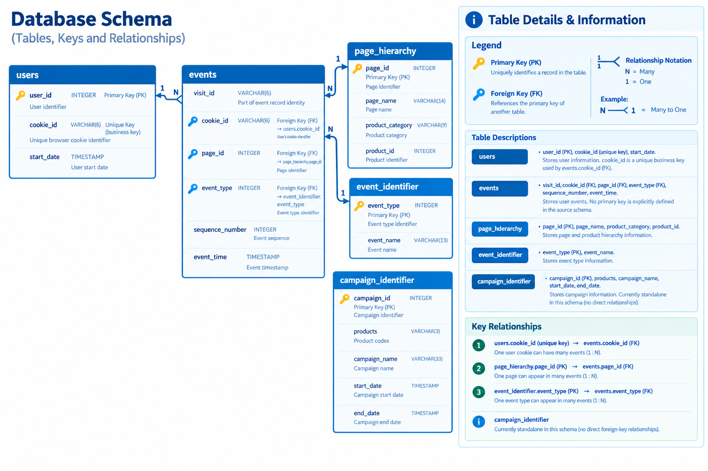
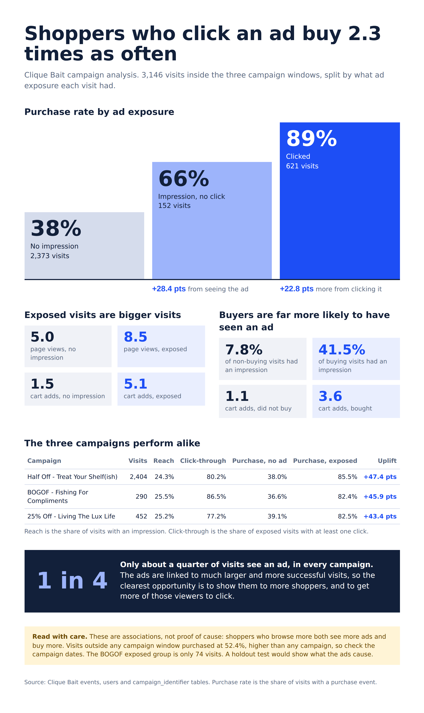

# Case Study #6: Clique Bait

**Tool:** DuckDB | **Skills:** joins across five tables, conditional aggregation with `FILTER`, ordered `string_agg`, CTE chains, `CREATE TABLE AS`, funnel and abandonment analysis, date-range campaign attribution, reading uplift with the right caveats

Challenge by Danny Ma: https://8weeksqlchallenge.com/case-study-6/

Blog post (full walkthrough): [Case Study #6: Clique Bait](ADD-BLOG-LINK)

[Back to all case studies](../README.md)

## The question

Clique Bait is an online seafood store. Its founder, Danny, comes from digital analytics and wants to know how visitors move through the store: who views a product, who adds it to the cart, who buys it, and where everyone else drops out. Three campaigns ran in early 2020 and nobody has measured whether they worked.

The job has three parts:

1. **Digital analysis.** Users, cookies, visits, events and the most viewed pages.
2. **Product funnel.** Views, cart adds, abandoned carts and purchases for every product and category.
3. **Campaign analysis.** One row per visit, used to produce at least five insights, including whether ad impressions and clicks lead to more purchases.

## The data

Five tables, in `clique_bait`. See [`data/`](data/).

| Table | What one row is | Key columns |
|---|---|---|
| `users` | a cookie belonging to a user | user_id, cookie_id, start_date |
| `events` | one logged event within a visit | visit_id, cookie_id, page_id, event_type, sequence_number, event_time |
| `event_identifier` | an event type | event_type, event_name |
| `campaign_identifier` | a campaign | campaign_id, products, campaign_name, start_date, end_date |
| `page_hierarchy` | a tagged page | page_id, page_name, product_category, product_id |

Event types: 1 Page View, 2 Add to Cart, 3 Purchase, 4 Ad Impression, 5 Ad Click.

## Approach

- **Grain first.** An `events` row is one event, not a visit and not a user. A visit is all events sharing a `visit_id`, and a user owns several cookies. Users, cookies, visits and events are four different counts, and the query runs whichever one you pick.
- **Events have no user.** `events` carries a `cookie_id`, so reaching a user means joining through `users`.
- **A visit belongs to the month it starts in.** A visit can run past midnight, so it is assigned to the month of its earliest event instead of being counted once per month it touches.
- **Purchases are a visit-level fact.** A purchase is logged on the Confirmation page, which has no product. A product counts as purchased when it was added to the cart in a visit that has a purchase event, and as abandoned when it was added in a visit that does not. This works because the data has no way to remove an item from the cart.
- **Rates, not counts, for "most likely".** "Most likely to be abandoned" ranks by abandoned over cart adds. A raw count would favour products that are simply added to more carts. `dense_rank` keeps ties, and ranks on the unrounded rate so rounding cannot create false ties.
- **`100.0`, not `100`.** Both columns are integers, so `100 * purchased / views` is integer division in many engines.
- **Average of rates vs rate of totals.** The B6 average gives every product equal weight. A traffic-weighted rate is `SUM(cart_adds) / SUM(views)`. They can differ, and only one describes what the store actually did.
- **One row per visit for campaigns.** `campaign_summary` holds page views, cart adds, a purchase flag, impressions, clicks, the campaign and the cart products in the order added. Every campaign question reads from it.
- **Campaign end dates need care.** They are midnight timestamps, so a plain `BETWEEN` would drop visits on the last day. The join compares against `end_date + 1 day`. Visits outside any campaign stay in with a null campaign, which gives a baseline.
- **Uplift is an association.** Visit level approximates "users who received an impression", and people who click are probably more engaged anyway.

Full queries: [`analysis/solutions.sql`](analysis/solutions.sql). Results: [`output/results.md`](output/results.md).

## What I found

Fill these in from your own run (see `output/results.md`); the structure I used:

- **Where the funnel leaks.** From A6, B3 and C5: ____ % of visits reach checkout and do not buy. The product with the highest abandon rate is ____. Most views: ____, most cart adds: ____, most purchases: ____.
- **Which campaign worked.** From C4, ranked on purchase rate and click-through rate against the no-campaign baseline: ____ (best), ____, ____.
- **Whether impressions matter.** From C3, the purchase rate of clicked visits is ____ % higher than no impression and ____ % higher than impression only.
- **Engagement caveat.** Purchasing visits average ____ page views against ____ for non-purchasing ones (C6), so a click may mark an engaged visitor rather than create one.

## Infographic

A single A4 infographic for management reporting.

## Recommendations for Danny

1. **Test campaigns against a held-out group** of users who are never shown the ad, so uplift can be measured instead of inferred.
2. **Target the highest-abandonment products** with cart-recovery messaging.
3. **Track view, cart and purchase rates weekly** from totals, not from averages of rates.

## Takeaway

Know what one row is, know what level your number lives at, and be honest about what a comparison can and can't prove.

## Limitations

- Campaign analysis is at visit level, which only approximates users who received an impression.
- The click uplift is correlational. Without a held-out group it cannot show the ad caused the purchase.
- Product purchases are attributed through cart adds in purchasing visits, not logged directly.
- The campaigns do not overlap and leave gaps, so the "no campaign" group mixes quiet periods with the period after March.

---
Dataset and problem statement © Danny Ma, 8 Week SQL Challenge. 
Solutions are my own.

---
*If you find any errors, feel free to email me at [sushant.kr.jha02@gmail.com](mailto:sushant.kr.jha02@gmail.com).*
