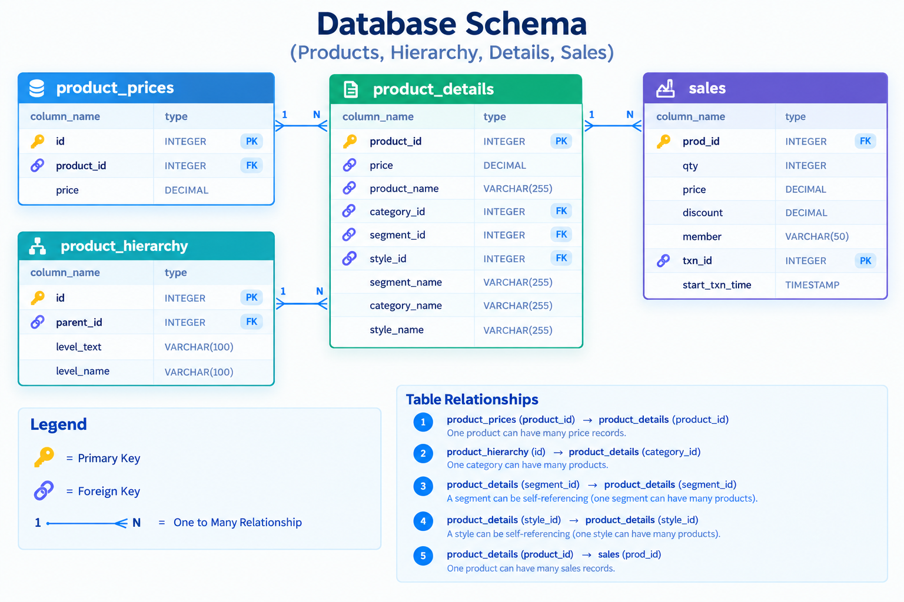

# Case Study #7: Balanced Tree Clothing Co.

**Tool:** DuckDB | **Skills:** joins across product and sales tables, conditional aggregation, window functions for rank and share of total, `QUALIFY`, percentiles with `quantile_cont`, self-joins for combination analysis

Challenge by Danny Ma: https://8weeksqlchallenge.com/case-study-7/

Blog post (full walkthrough): [Case Study #7: Balanced Tree Clothing Co.](https://sushant-jha.super.site/my-blogs/case-study-7-balanced-tree-clothing-co)

[Back to all case studies](../README.md)

## Status: what is done and what is missing

This case study is **partly solved**. The Reporting Challenge and the Bonus Challenge are not done yet.

| Part | Questions | Status |
|---|---|---|
| A. High Level Sales Analysis | A1 to A3 | Done |
| B. Transaction Analysis | B1 to B6 | Done |
| C. Product Analysis | C1 to C10 | Done |
| **D. Reporting Challenge** | one monthly report script, January then February | **Not solved yet** |
| **E. Bonus Challenge** | rebuild `product_details` from `product_hierarchy` and `product_prices` | **Not solved yet** |

Other things still to add before this folder is complete:

- [ ] Paste the `sales` INSERT block into [`data/schema.sql`](data/schema.sql) where marked.
- [ ] Result screenshots in `output/`, and the values in [`output/results.md`](output/results.md).
- [ ] Entity relationship diagram saved as `data/schema.png`.
- [ ] The "What I found" section below, from your own run.
- [ ] The blog link at the top of this file.
- [ ] Solve D and E, add them to [`analysis/solutions.sql`](analysis/solutions.sql), then update the table above and the sections marked *pending*.

Case Study #6 also had an infographic extension. The #7 brief does not ask for one, so there is none here.

## The question

Balanced Tree Clothing Co. sells an optimised range of clothing and lifestyle wear. Its CEO, Danny, wants the merchandising team to understand sales performance and wants a basic financial report that can be shared with the wider business.

The job has four parts:

1. **High level sales analysis.** Quantity, gross revenue and discounts.
2. **Transaction analysis.** Basket size, revenue spread, discount and the member split.
3. **Product analysis.** Top products, segment and category performance, revenue splits, penetration and the most common three-product combination.
4. **Reporting challenge** *(pending)*. One script that produces all of the above for the previous month, shown for January and then re-run for February with minimal changes. There is also a **bonus** *(pending)*: rebuild `product_details` from the hierarchy and price tables.

## The data

Four tables, in `balanced_tree`. See [`data/`](data/).

| Table | What one row is | Key columns |
|---|---|---|
| `product_details` | a product (one style in the range) | product_id, price, product_name, category_id, segment_id, style_id, category_name, segment_name, style_name |
| `sales` | one product line within a transaction | prod_id, qty, price, discount, member, txn_id, start_txn_time |
| `product_hierarchy` | a node in the category, segment, style tree | id, parent_id, level_text, level_name |
| `product_prices` | the price of a style | id, product_id, price |

Only `product_details` and `sales` are needed for sets A, B and C. The other two tables are used only by the bonus question.

## Approach

- **Grain first.** A `sales` row is one product line, not a transaction and not a unit sold. A transaction is all rows sharing a `txn_id`, so transaction counts use `COUNT(DISTINCT txn_id)`.
- **Discount is a percentage.** The discount amount is `qty * price * discount / 100`. The multiplier is `100.0`, not `100`, so integer inputs never hit integer division.
- **Revenue means before discount** (`qty * price`) unless a query says otherwise. Net revenue is shown only in B6, because members may get bigger discounts.
- **Collapse to the transaction first.** Questions about baskets (B2 to B6) build one row per transaction in a CTE, then aggregate. Averaging per line would give a different, smaller number.
- **Percentiles need a transaction-level table.** B3 sums revenue per transaction, then uses `quantile_cont` for a continuous percentile.
- **Shares need a stated parent.** C6, C7 and C8 divide by the segment, category or grand total using a window (`PARTITION BY ...` or an empty `OVER ()`), so the parent is written into the query.
- **Plain sums roll up, ratios don't.** Quantity, revenue and discount add from product to segment to category. Penetration and transaction counts do not, because a basket can contain several products.
- **Top selling means quantity.** Revenue is shown next to it, since the two can disagree. `RANK` inside `QUALIFY` keeps ties instead of dropping them with `LIMIT`.
- **Penetration is a share of baskets.** C9 counts distinct transactions per product and divides by all transactions.
- **Combinations by self-join.** C10 joins the deduplicated transaction-product list to itself three times, with `t1 < t2 < t3` on product name so each combination is counted once, in a fixed order.

Full queries: [`analysis/solutions.sql`](analysis/solutions.sql). Results: [`output/results.md`](output/results.md).

## What I found

Fill these in from your own run (see `output/results.md`); the structure I used:

- **Headline.** Total quantity ____, gross revenue ____, total discount ____ (A1 to A3), across ____ transactions (B1).
- **Basket.** The average basket holds ____ distinct products (B2). Revenue per transaction has a median of ____ with a p25 to p75 range of ____ to ____ (B3). The average discount is ____ per transaction (B4).
- **Members.** ____ % of transactions are members (B5). A member transaction averages ____ gross and ____ net, against ____ and ____ for non-members (B6).
- **What carries the business.** The top 3 products by revenue are ____ (C1). The leading category is ____ with ____ % of revenue (C8).
- **Top sellers.** By quantity, the top product per segment is ____ (C3) and per category is ____ (C5). Do they match the revenue leaders?
- **Bought together.** The most penetrating product appears in ____ % of transactions (C9). The most common three-product combination is ____ (C10).

## Reporting challenge *(pending)*

Not solved yet. The goal is one script that builds every table above for a single month, with the month set in one place, run for January and then for February. Add the approach, the output tables, and a table mapping each output to the question it answers.

## Bonus challenge *(pending)*

Not solved yet. The goal is one query that rebuilds `product_details` from `product_hierarchy` and `product_prices`, checked against the original table in both directions.

## Recommendations for Danny

1. **Track gross revenue, discount and net revenue side by side** every month, so discount cost is never hidden.
2. **Test bundles** around the most common three-product combination.

## Takeaway

Know what one row is, know what level your number lives at, and write the base of every percentage into the query.

## Limitations

- Parts D and E are not solved yet.
- Revenue is before discount unless stated, so it is not what the customer paid.
- "Top selling" is by quantity. By revenue the winners can differ.

---
Dataset and problem statement © Danny Ma, 8 Week SQL Challenge. Solutions are my own.

---
*If you find any errors, feel free to email me at [sushant.kr.jha02@gmail.com](mailto:sushant.kr.jha02@gmail.com).*
